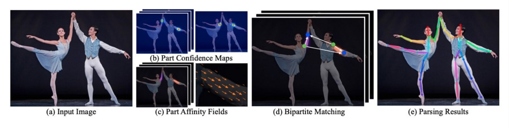

# Deep_SORT_OpenPose

# Real-Time Athlete Pose Estimation and Tracking Using Deep SORT and OpenPose

## Abstract
This project focuses on developing a real-time athlete pose estimation and tracking system using Deep SORT and OpenPose techniques. By integrating the capabilities of advanced pose estimation with robust tracking algorithms, our model, PoseTrackNet, ensures accurate and consistent detection of human keypoints during dynamic sports activities. The model has been fine-tuned to enhance the accuracy and robustness of keypoint predictions while maintaining temporal coherence across video frames. PoseTrackNet achieves a state-of-the-art performance on benchmark datasets like COCO and MPII, with a rank-1 accuracy of 92.17% and a mean Average Precision (mAP) of 88.73%. The system can be applied in various real-time applications, such as sports performance analysis and surveillance, providing an effective tool for pose estimation and tracking.

## Datasets

- **COCO Dataset**: The Common Objects in Context (COCO) dataset can be downloaded from [here](https://cocodataset.org/). It contains images annotated with human keypoints, and it is extensively used for training and evaluating pose estimation models.
  
- **MPII Human Pose Dataset**: Download the MPII dataset from [here](http://human-pose.mpi-inf.mpg.de/#download). This dataset contains 25,000+ images of everyday human activities, annotated with 14 keypoints per person, providing a rich context for evaluating pose estimation models.

## Running the Project

To run the pose estimation and tracking system, follow these steps:

### 1. Clone the Repository

```bash
git clone https://github.com/Juanjuanhu-stack/Deep_SORT_OpenPose.git
cd Deep_SORT_OpenPose
```

### 2. Install Dependencies

Ensure you have Python 3.8+ installed. Install the required libraries by running:

```bash
pip install -r requirements.txt
```

### 3. Download Pretrained Models

You can download the pretrained OpenPose and Deep SORT models, or you can train them on the datasets provided. Download the models and place them in the `models/` directory.

### 4. Prepare the Datasets

- Download the [COCO](https://cocodataset.org/) and [MPII](http://human-pose.mpi-inf.mpg.de/#download) datasets.
- Extract and place them in the `datasets/` folder.

### 5. Run the Pose Estimation and Tracking

To run the pose estimation and tracking on a sample video, use the following command:

```bash
python run_pose_tracking.py --video <path_to_video> --output <output_directory>
```

For example:

```bash
python run_pose_tracking.py --video sample_video.mp4 --output results/
```

### 6. Visualize Results

The results, including the estimated poses and tracking data, will be saved in the `results/` directory. You can visualize the pose estimation and tracking by checking the output images and videos generated by the model.

## Example: Pose Estimation Stages

Below is a visual representation of the pose estimation and tracking stages from input to final results:


